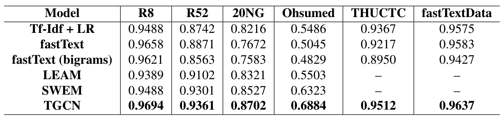
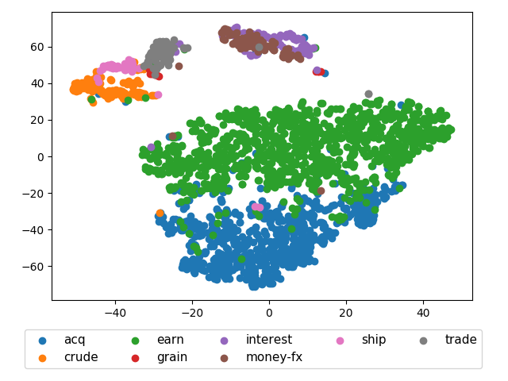
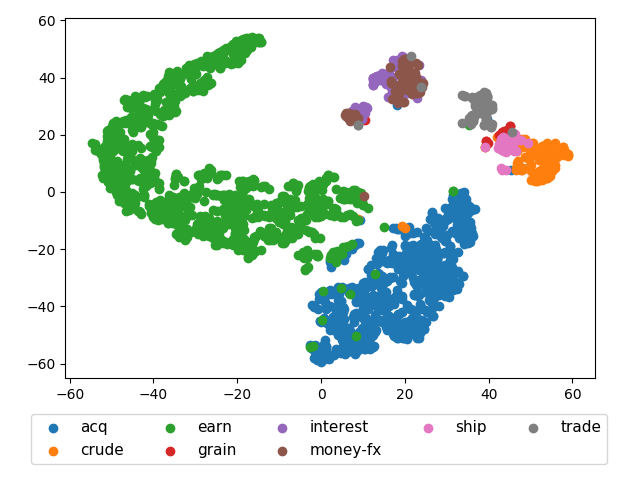

# TGCN: A Novel Deep Learning Model for Text Classification

This project contains 

- Re-implementation of ["Graph Convolutional Networks for Text Classification"](https://arxiv.org/abs/1809.05679) in tensorflow 2.1.
- Some baseline models mentioned in original paper.
- Code is highly based on [official repository](https://github.com/yao8839836/text_gcn).


## Requirement

- python 3.6
- tensorflow 2.1.0
- nltk 3.4.5
- fasttext 0.9.2 (Optional)

## Run

### Preprocess

```bash
cd ./preprocess
python remove_words.py <dataset>
python build_graph.py <dataset>
```
The selections of `<dataset>` are `R8`, `R52`, `20NG`, `ohsumed`, `THUCTC`, `Chinese`.
### Training

```bash
python train.py  <dataset>
```
The selections of `<dataset>` are `R8`, `R52`, `20NG`, `ohsumed`, `THUCTC`, `Chinese`.

### Visualization

```bash
cd visual
python tsne.py <dataset> <length>
```
The selections of `<dataset>` are `R8`, `R52`, `20NG`, `ohsumed`, `THUCTC`, `Chinese`.

The selections of `<length>` are `1`, `2`.


## Data

`R8` is provided in `cleaned_data` dictionary. Other datasets can be downloaded at [Google drive](https://drive.google.com/drive/folders/1D4lp9zgS4YdVQII_luJXdhzvPYhWaiB6?usp=sharing).

## Results

### Accuracy

<p align="center">

</p>

### Embeddings

R8 embeddings in first layer:

<p align="center">

</p>

R8 embeddings in second layer:

<p align="center">

</p>

More images can be found at `visual` dictionary.

## Reference

- The official implementation: https://github.com/yao8839836/text_gcn
- PyTorch version: https://github.com/iworldtong/text_gcn.pytorch
- Paper: https://arxiv.org/abs/1809.05679


## Contributors:
* [Yuan Li](yl6606@nyu.edu)
* [Dongzi Qu](dq394@nyu.edu)
